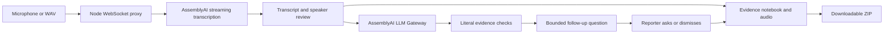

# Nonius — The Interview Companion

**The next question, with the source attached.**

Nonius turns an interview into a working reporting desk: a live transcript,
questions to cover, evidence-linked follow-ups, and a downloadable notebook with
original audio. The reporter decides what to ask and when the companion speaks.

Built for the [AssemblyAI Voice Agent Hackathon](https://lablab.ai/ai-hackathons/assemblyai-voice-agent-hackathon).
This is a working, research-informed prototype. Journalist benefit has not yet
been measured in a practitioner study.

## Run in two commands

Requires **Node.js 22 or newer**.

```sh
npm ci --ignore-scripts
npm run demo
```

Open **http://127.0.0.1:4317** and choose **Explore a sample interview**.
This mode ignores API keys, including an existing `.env`. The fictional sample
uses synthetic audio and saved model responses, clearly labeled in the app.
It lets you inspect suggestions, save excerpts, replay audio and export a notebook
without making a provider request.

To use a microphone or transcribe your own WAV, copy `.env.example` to `.env`,
set `ASSEMBLYAI_API_KEY`, then run `npm start`. Never commit `.env`.
Imported recordings must be 16 kHz, mono PCM16 WAV files. Live usage consumes
AssemblyAI credits and is subject to the configured limits.

## Use the interview desk

1. Add a title, reporting brief and questions you want answered.
2. Obtain participants' agreement to recording and cloud processing. Start the
   microphone or import a WAV. Imported audio plays alongside transcription.
3. Voices appear as Person A, Person B, and so on. Name each person and choose
   Reporter or Interviewee. Names apply throughout this interview. Correct a
   mistaken speaker on a passage; review proposed final label changes before
   accepting them. Consecutive speech from one person stays in one card.
4. Click **Look for a follow-up**, or ask for one by voice. Optional automatic
   analysis is controlled in the follow-up settings. Inspect the supporting
   passage, mark the suggestion Asked, dismiss it or request spoken output.
5. Save excerpts in the **Evidence notebook**, replay their audio and add your
   own notes. An audio-check box records your own review, not an AI verification.
6. Download the ZIP before closing the page. It contains the transcript, notes,
   available audio and a SHA-256 manifest. Unsaved interview data lives in browser
   memory and is lost when the page closes.

## What runs where



- **Speech to text:** AssemblyAI `universal-3-5-pro`, with speaker diarization
  for interviews. Voice commands use transcription without diarization.
- **Follow-ups:** `qwen3.5-4b-32k-fast` through AssemblyAI's LLM Gateway. It receives
  the brief, prepared questions and coverage, recent suggestion history and up
  to ten recent speaker passages, within a bounded text budget. It does not receive
  an unlimited interview history or browse the web.
- **Evidence checks:** application code rejects unsupported or ambiguous excerpts
  and unsupported focus text. The model selects a category and literal evidence;
  code supplies the question template. Exact quotation does not establish truth
  or usefulness. Returning no suggestion is a valid outcome.
- **Spoken replies:** Windows System.Speech locally, with browser speech synthesis
  as the fallback on other systems. Availability depends on the browser and voice.
- **Privacy:** provider credentials stay on the server. Live audio and analysis
  context go to AssemblyAI; notebook content stays in browser memory until exported.

There are two runtime packages, `ws` and `fflate`, both MIT. No model download,
database or frontend build is required for local use.

## Research and evaluation

The [research review](docs/RESEARCH.md) connects design decisions to primary
interviewing research and separates empirical findings from professional norms
and engineering choices. The [proposed practitioner pilot](docs/PRACTITIONER_PILOT.md)
describes the human evaluation still needed.

```sh
npm test
npm run reproduce
npm run check
```

These checks make **no AssemblyAI calls**. The test suite covers transcript and
speaker revisions, follow-up context, quotation validation, audio playback,
exports, access controls and budget handling. `reproduce` checks preserved hashes
and recalculates historical counts from stored outputs, including failures.

| Evidence | Result and scope |
|---|---|
| Historical v2 cue categories | 29/34 exact matches after one recovery of 18 HTTP 429 failures; not current v3 accuracy |
| Historical speech slots | 19/19 slots in eight synthetic English clips; not word-error rate |
| Altered quotation rejection | 10,000 mutations of one fixture; a software invariant |
| Current follow-up development checks | Known-input regressions; no independent usefulness ratings |
| Journalist outcomes | Not measured; pilot proposed |

Read the [evaluation report](docs/EVALUATION.md) for denominators, all five category
misses, publication redactions and the distinction between the frozen v2 adapter
and current v3 follow-up selector. See [limitations](docs/LIMITATIONS.md) before
using the prototype with real reporting material.

## Hosting and security

See [deployment instructions](docs/DEPLOYMENT.md). The hosted launcher starts in
keyless sample mode unless live mode is explicitly configured. Live hosting needs
HTTPS, a private server-side API key, a strong demo password, an exact hostname
allowlist and durable budget storage. Do not put a provider key in client code,
build arguments, URLs or a public repository.

GitHub Pages cannot run this Node/WebSocket backend. Replit can run it; the hosting
provider and AssemblyAI have their own service terms. Read [SECURITY.md](SECURITY.md)
for the current protections and their limits.

## Repository guide

| Path | Contents |
|---|---|
| `server.mjs`, `lib/` | HTTP/WebSocket backend, cue checks, speakers and audio |
| `public/` | Browser interface and recording/playback |
| `tests/` | Offline software and regression checks |
| `fixtures/` | Fictional sample and synthetic speech fixtures |
| `eval/` | Authored cases, stored measurements and provenance |
| `docs/` | Research, evaluation, limitations and deployment |

Original code and documentation are [MIT licensed](LICENSE). Preserve the
[third-party notices](THIRD_PARTY_NOTICES.md). Services, OS/browser voices and
research papers retain their own terms; no model weights or paper PDFs are shipped.

